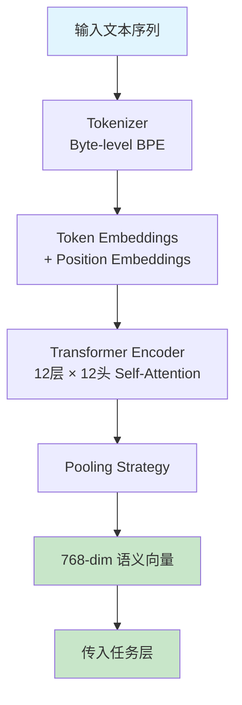

# 表征层（Representation Layer）

> **位置**: `src/representation/encoder.py`  
> **模块**: `RoBERTaEncoder`

## 1. 职责

将自然语言文本（英文）转换为稠密语义向量，作为下游 MBTI 四维分类器的输入特征。表征质量直接决定预测精度上限。

---

## 2. 模型选型

| 模型 | 参数量 | 层数 | 向量维度 | 适用场景 |
|------|--------|------|----------|----------|
| **roberta-base** ✅ | 125M | 12 层 | 768 | **主模型**，效果与成本最佳平衡 |
| roberta-large | 355M | 24 层 | 1024 | 精度优先，需更多 GPU 显存 |
| distilroberta-base | 82M | 6 层 | 768 | 推理速度优先，精度略低 ~3% |

> 当前项目使用 **`roberta-base`**，数据集为英文论坛帖子，与 RoBERTa 预训练语料（BookCorpus + CC-News + OpenWebText + Stories）的文本风格接近。

---

## 3. 处理流程



### 3.1 Tokenizer

RoBERTa 使用 **Byte-level BPE** 分词器，词表大小 50,265：

```
原始文本: "I enjoy reading books alone."
     ↓
Tokenized: <s>, I, Ġenjoy, Ġreading, Ġbooks, Ġalone, ., </s>
Token IDs: [0, 100, 2897, 1838, 4392, 4333, 4, 2]
```

- `<s>`: 句子起始符（RoBERTa 的 CLS 等价物）
- `Ġ`: 前导空格标记
- Token 上限: `max_length=512`（覆盖绝大部分样本）

### 3.2 Transformer Encoder

```
输入: (batch, seq_len) Token IDs
     ↓ Embedding Layer
(batch, seq_len, 768)
     ↓ ×12 Transformer Blocks
     每个 Block:
       - Multi-Head Self-Attention (12 heads)
       - LayerNorm
       - Feed-Forward Network (3072 → 768)
       - LayerNorm + Residual
     ↓
(batch, seq_len, 768)  ← 最后一层隐藏状态
```

### 3.3 Pooling 策略

| 策略 | 做法 | 特点 | 推荐场景 |
|------|------|------|----------|
| **Mean Pooling** ✅ | 所有有效 token 取均值 | 信息利用充分，鲁棒性强 | **默认推荐** |
| CLS Token | 取 `<s>` 位置输出 | 原生分类方式 | 快速实验 |
| Max Pooling | 每维度取最大值 | 突出关键词信号 | 短文本 |
| Attention-Weighted | 用最后一层注意力加权平均 | 自适应聚焦关键 token | 可解释性需求 |

```python
# 使用示例
encoder = RoBERTaEncoder(pooling="mean")    # 默认推荐
encoder = RoBERTaEncoder(pooling="cls")     # 传统方式
encoder = RoBERTaEncoder(pooling="max")     # 关键词突出
encoder = RoBERTaEncoder(pooling="attention")  # 注意力加权
```

---

## 4. 类结构

```
RoBERTaEncoder (nn.Module)
├── tokenizer: AutoTokenizer        # Byte-level BPE 分词器
├── backbone: AutoModel             # RoBERTa 预训练权重
├── pooling: PoolingStrategy         # 池化策略（可插拔）
│   ├── CLSPooling                  # <s> token
│   ├── MeanPooling                 # 均值 [默认]
│   ├── MaxPooling                  # 最大值
│   └── AttentionPooling            # 注意力加权
├── hidden_size: int = 768
├── max_length: int = 512
└── device: torch.device
```

---

## 5. 模块接口

### 5.1 初始化

```python
RoBERTaEncoder(
    model_name: str = "roberta-base",   # HuggingFace 模型名
    pooling: str = "mean",              # Pooling 策略
    max_length: int = 512,              # 最大 token 数
    device: str | None = None,          # "cuda" / "cpu"，None=自动
    freeze_backbone: bool = False,      # 是否冻结 RoBERTa 权重
    output_attentions: bool = False,    # 是否输出注意力权重
)
```

### 5.2 推理编码

```python
encode(
    texts: str | list[str],    # 文本或文本列表
    batch_size: int = 32,      # 批大小
    show_progress: bool = False,
) -> torch.Tensor              # 输出: (N, 768)，位于 CPU
```

### 5.3 训练前向

```python
forward(
    input_ids: torch.Tensor,       # (batch, seq_len)
    attention_mask: torch.Tensor,  # (batch, seq_len)
) -> torch.Tensor                  # 输出: (batch, 768)，梯度保留
```

---

## 6. 与上下游的衔接

```
数据层 (data/preprocess.py)
    │ 输出: train.csv (text 列)
    │
    ▼
表征层 (本模块)
    │ encode(texts) → (N, 768) Tensor
    │ forward(input_ids, attention_mask) → (N, 768)
    │
    ▼
任务层 (src/model/classifier.py, 待实现)
    │ 输入: (batch, 768)
    │ 输出: {(EI, SN, TF, JP) 四维概率}
```

### 配合 HuggingFace Datasets 使用

```python
from datasets import load_dataset
from src.representation import RoBERTaEncoder

dataset = load_dataset("csv", data_files={"train": "data/train.csv"})

# 方案A: 离线编码（先全部编码再训练）
encoder = RoBERTaEncoder(pooling="mean")
vectors = encoder.encode(dataset["train"]["text"], batch_size=64)

# 方案B: 在线编码（训练时逐 batch 编码 —— 推荐）
# 在 DataLoader 的 collate_fn 中调用 encoder.forward()
```

---

## 7. 设计决策

| 决策 | 选择 | 理由 |
|------|------|------|
| 模型 | roberta-base (125M) | 在分类任务上效果与 large 差距 < 2%，但快 3× |
| Pooling 默认值 | Mean Pooling | 对长度变化鲁棒，信息利用比 CLS 更充分 |
| 冻结选项 | `freeze_backbone` | 支持作为静态特征提取器的 Baseline 实验 |
| BPE 分词 | Byte-level (原生) | 无需处理 OOV，对拼写错误鲁棒（论坛数据常见） |
| 最大长度 | 512 | 覆盖绝大多数样本（数据均值 ~3255 字符 ≈ ~800 BPE tokens，会被截断） |

> ⚠️ 当前 `max_length=512` 会截断部分长文本（均值 3255 字符对应 ~800+ tokens）。实验中可尝试 `max_length=514`（RoBERTa 硬上限）或分段编码取均值。

---

## 8. 文件清单

```
src/representation/
├── __init__.py      # 模块导出
├── encoder.py       # RoBERTaEncoder + Pooling 策略
└── doc.md           # 本文档
```
